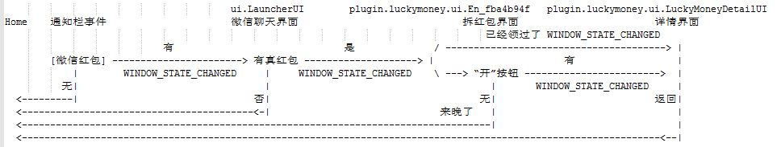

# 微信抢红包
### 效果展示

## 前言
出于课程需要编写的一个项目。只实现了基本的抢微信红包功能。

> 抢红包有风险请谨慎使用。
>
> 代码仅作学习之用。

## 原理
### 关于Accessibility
Accessibility是Android的一个`辅助服务`其设计初衷是面向使用Android手机有障碍(视觉、听觉等)的特殊用户，使其能更容易地使用手机。除此之外，AccessibilityService还可以用于将一些人工操作进行自动化处理，从而将人从这些无聊繁琐的重复操作中解放出来，比如抢红包。

### 抢红包流程
用过微信的都知道，如果不是在微信的可见界面，当收到新消息时就会在通知栏提醒用户。因此可以监听通知栏事件抓取关键字进行处理，具体步骤如下：
1. 在非微信界面收到通知时，判断是否是微信通知以及是否包含`[微信红包]`关键字，如果是则发送`Intent`打开通知进到微信聊天界面。
2. 通过聊天界面中的`微信红包`和`领取红包`关键字定位红包，并执行`CLICK_ACTION`动作，进入拆红包界面。
3. 找到拆红包界面中`開`字按钮，然后同样执行`CLICK_ACTION`动作开红包，进入红包详情界面。
4. 红包领取完毕，执行`GLOBAL_ACTION_BACK`返回聊天界面或者`GLOBAL_ACTION_HOME`返回桌面。

### 流程图


### 设计思路  
在以上过程中，由一个界面到下一个界面时都会先触发一个WINDOW_STATE_CHANGED事件启动新窗口，然后在加载窗口内容并触发多个WINDOW_CONTENT_CHANGED事件。因此可以在WINDOW_STATE_CHANGED的时候通过事件的className判断当前位于哪个界面，然后在WINDOW_CONTENT_CHANGED时根据当前所处的界面执行相应操作。  
### 伪代码：
```java
windowState  = null
packageStage = null

switch(evenType):
	case TYPE_NOTIFICATION_STATE_CHANGED:
		if 通知栏信息含有 [微信红包] :
			packageStage = NEW_PACKAGE
			send Intent 
			
	case TYPE_WINDOW_STATE_CHANGED:
		// 当微信主界面启动时触发（从通知栏进入聊天界面、从桌面进入微信）
		// 但是微信主界面进入聊天界面时不会再触发
		switch (even.className):
			case ui.LauncherUI:
				if 处在聊天界面:
					windowState = CHATTING_UI
				else :
					windowState = OTHER
			case plugin.luckymoney.ui.En_fba4b94f:
				windowState = LUCKYMONEY_UI
			case plugin.luckymoney.ui.LuckyMoneyDetailUI:
				windowState = DETAIL_UI
			default:
				if 处在聊天界面:
					windowState = CHATTING_UI
				else :
					windowState = OTHER
		
	case TYPE_WINDOW_CONTENT_CHANGED:
		switch (windowState):
			case CHATTING_UI:
				if packageStage == NEW_PACKAGE:
					if 有真正的红包:
						packageStage = OPEN_PACKAGE
						模拟点击红包
					else: 
						packageStage = WAIT_PACKAGE
						返回Home
			case LUCKYMONEY_UI:
				if packageStage == OPEN_PACKAGE:
					if 有“开”按钮:
						模拟点击按钮
					else:
						packageStage = WAIT_PACKAGE
						返回Home
			case DETAIL_UI:
				if packageStage == OPEN_PACKAGE:
					packageStage = WAIT_PACKAGE
					返回Home
```

### 技术要点 & 关键代码
##### 如何识别聊天界面中的红包
  通过`DDMS`工具里的`Dump View Hierarchy For UI Automator`对红包结构的分析一个红包节点下会有三个子节点: 两个TextView和一个ImageView，并且两个TextView的内容分别为`领取红包`和`微信红包`。因此可以先通过关键字`微信红包`找到相应节点然后通过判断其是否存在关键字为`领取红包`的兄弟节点来判断是否是真的红包。
```java
    private AccessibilityNodeInfo findPackage(AccessibilityNodeInfo rootNode){
        AccessibilityNodeInfo nodeInfo11, nodeInfo12, nodeInfo1;
        List<AccessibilityNodeInfo> list = rootNode.findAccessibilityNodeInfosByText("微信红包");
        for(int i=list.size()-1; i>=0; --i) {
            nodeInfo12 = list.get(i);
            nodeInfo1 = nodeInfo12.getParent();
            if(nodeInfo1.getChildCount()<2) continue;
            nodeInfo11 = nodeInfo1.getChild(1); //通过"微信红包"节点找到"领取红包"节点
            if(nodeInfo11.getText()==null) continue;
            String s = nodeInfo11.getText().toString();
            if(s==null) continue;
            if (s.equals("领取红包") || s.equals("查看红包")) {
                return nodeInfo1;
            }
        }
        return null;
    }
```

##### 如何定位拆红包界面中的按钮
  通过分析界面结构发现`開`字被放在了按钮的背景图片中，因此无法通过关键字`開`定位到按钮。但是这个界面中只有这么一个按钮(`Button`)因此可以直接通过组件的ClassName来定位。
```java 
	final AccessibilityNodeInfo open = AccessibilityHelper.findNodeInfosByClassName(rootWindow,"android.widget.Button");//開 按钮
	if(open==null){//红包已经被抢完
		packageStage = PACKAGE_STAGE_WAIT;
		AccessibilityHelper.performBack(this);
	}
	else {
		long delay = getConfig().getDelayTime();
		if(mHandler==null) mHandler = new Handler();
		mHandler.postDelayed(new Runnable() {
			@Override
			public void run() {
				AccessibilityHelper.performClick(open);
			}
		},delay);
	}
```
  
##### 如何判断是群聊界面还是单聊界面
  正常情况下群聊界面的title会以“`(`+`群聊人数`+`)`”结尾。因此只要提取到群聊的title在判断其最后一个字符是否是`)`即可。
```java 
	// 通过id查找title
	String id = "com.tencent.mm:id/gh";
	String title = null;
	AccessibilityNodeInfo target = AccessibilityHelper.findNodeInfosById(nodeInfo, id);
	if(target != null) {
		title = String.valueOf(target.getText());
	}
	if(title != null){
		if(title.endsWith(")")) return CHATTING_UI_GROUP;
		else return CHATTING_UI_SINGLE;
	}
```

##### 在聊天界面如何识别已经抢过的红包
  目前还无法在不点开的情况下识别红包是否已经抢过。为了避免见红包就点而造成的不良用户体验，本app只能通过通知栏的通知触发，也就是说在聊天界面收到新红包时不会触发。

  

## Reference
* [codeboy](https://github.com/lendylongli/qianghongbao ) codeboy抢红包
* [geeeeeeeeek](https://github.com/geeeeeeeeek/WeChatLuckyMoney/tree/dev ) WeChatLuckyMoney


